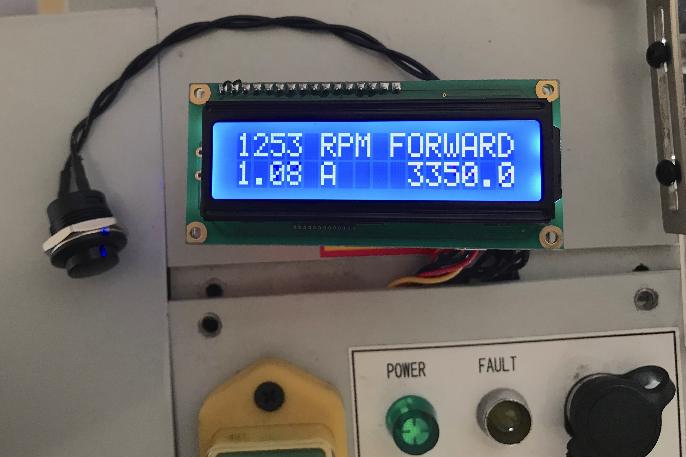
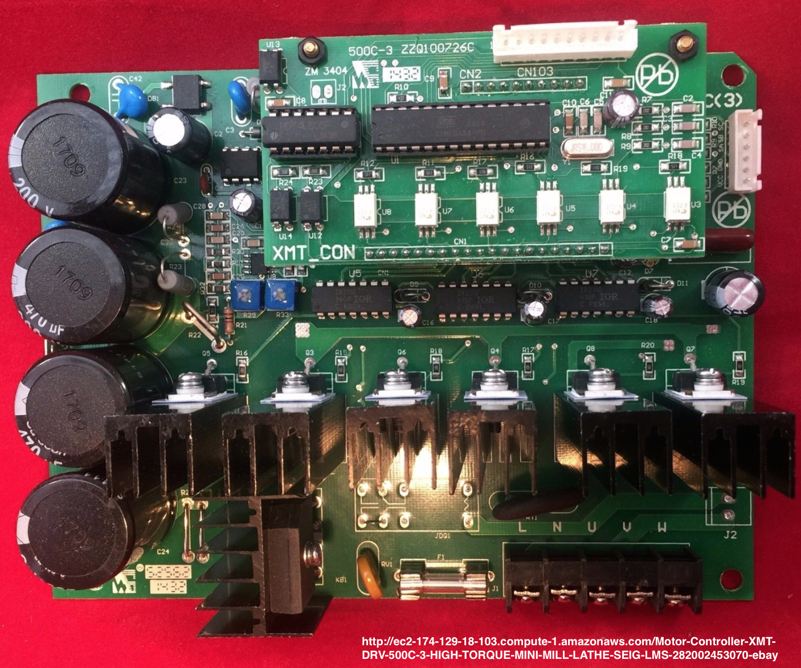

# bldc_motor_monitor
This is a motor monitor for the LMS5200 mini-lathe, LMS3990 mini-mill and similar tools that use the XMT-DRV-500C(3) / ZM3404 BLDC motor controller.

This project provides a small 2x16 line LCD display showing:
- Spindle RPM and direction
- Spindle revolution counter
- Motor current

It consists of a small PCB hosting the LCD, Arduino Micro R3, and connectors that mate inline with the BLDC sensor cable. It uses an 
optional toroidal transformer to sense AC line current.  A single pushbutton is used to clear the rev count and alternate between
modes. This photos shows the board during early testing.  A mounting solution is in progress.

This project was motivated by the need to keep an accurate count of spindle revolutions while winding coils on a mini-lathe. 
Since the BLDC motor controller already has a means of tracking spindle revolutions, it was easy to tap into this circuit rather than 
adding external encoders or hall-effect sensors.  

The motor controller in my lathe is this one pictured below. I haven't been able to find much good documentation on this board,
but it does seem to be pretty widely used. The pinout for the hall-effect connector is learned by inspection.  Recently I found 
a [very low-quality schematic](doc/500W-1000W_spindle_control_PCB_01.jpg?raw=true). It may or may not be for this particular driver board. 

### WARNING and DISCLAIMER
Although the BLDC 5V power seems to be isolated from AC mains and chassis, be careful to avoid 
risk of shock. I have no control over your BLDC driver circuitry, and it might zap you if you touch it. 
It is possible your machine uses a different driver board or a different hardware revision that is incompatible, even if it looks similar.
**Using this project can result in damage to your equipment, and danger or injury to yourself. If you choose to use 
this project, I will not be held liable for any damage or injury or repairs.**  Take all the usual precautions when working 
with AC-mains powered equipment. To avoid risk of damage to your PC, do not connect to the Arduino USB while the board is connected 
to the motor controller.  
